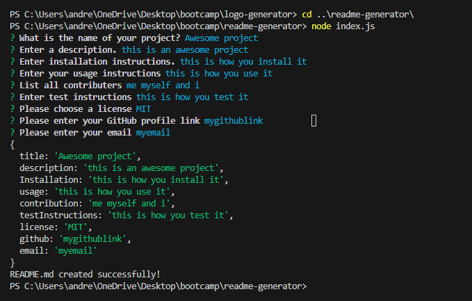

# README Generator

## Description
This is an application that runs in the console and will prompt you to enter information for each section of a high quality README and then generate the full document for you.

## Installation
You will need to have node.js installed as well as Inquirer.
- [node.js](https://nodejs.org/en) Install the LTS version
- [Inquirer](https://www.npmjs.com/package/inquirer#documentation) Use version 8.2.4

## Usage
Open the terminal and type 'node index.js' to initiate the generator. Answer the questions it asks you and when your done it will generate the README file in the root directory.

*Terminal after all questions are answered*

[Demo Video](https://drive.google.com/file/d/10QoWyKrllv8vVQG8e6-r5S-BeQC7_Yan/view)

## License

This project is licensed under the [MIT License](LICENSE).

## Questions

[My GitHub Profile](https://github.com/Andrewchall92)